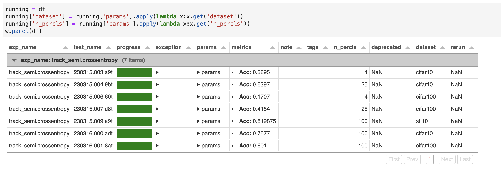
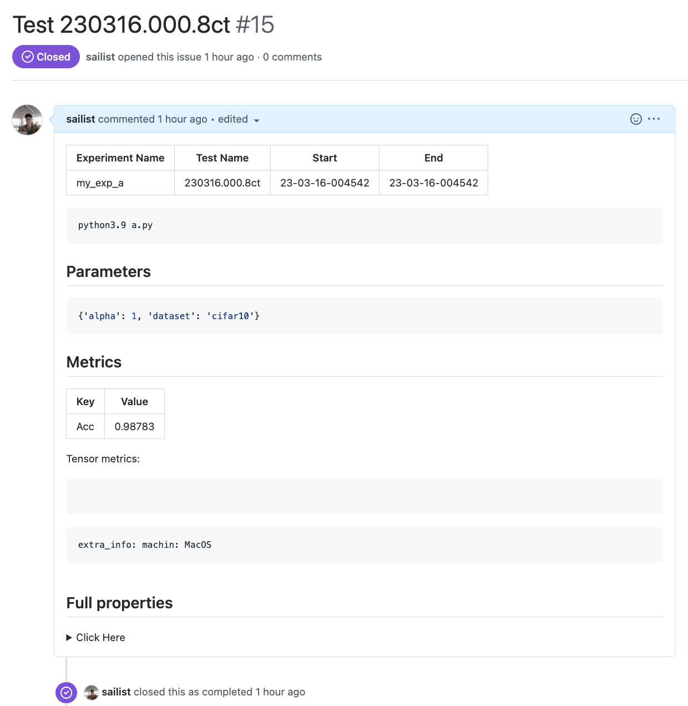

# lumo

[](https://badge.fury.io/py/lumo)

[](https://github.com/Lightning-AI/lightning/blob/master/LICENSE)


`lumo` 是一个精简高效的库，简化了实验所需的所有组件的管理，并特别关注增强深度学习实践者的体验。

- 实验管理：: 为每次运行分配唯一路径，区分不同类型的文件并存储；通过 git 管理代码快照；记录实验中产生的一切信息，保障可回溯、可复现
- 参数管理：基于 fire 提供比 argparser 更便捷的参数管理
- 运行时配置：提供多级作用域下的配置管理
- 可视化：基于 [Panel](https://panel.holoviz.org/index.html) 提供可交互的 jupyter 实验管理面板
- 为深度学习提供额外的优化
    - 训练：基于 Trainer 提供可任意扩展的训练逻辑简化，并提供完善的回调逻辑
    - 优化器：参数与优化器构建一体化
    - 数据: 数据集构建流程抽象、组合多个 DataLoader、...
    - 分布式训练：同样支持多种训练加速框架，统一抽象，方便随时切换
- 更多工具类...


# :book: 目录

- :book: [目录](#book-目录)
- :cloud: [安装](#cloud-安装)
- :book: [快速开始](#book-快速开始)
  - :small_orange_diamond: [已有项目嵌入](#small_orange_diamond-已有项目嵌入)
  - :small_orange_diamond: [从零开始](#small_orange_diamond-从零开始)
  - :small_orange_diamond: [可视化界面](#small_orange_diamond-可视化界面)
  - :small_orange_diamond: [复现实验](#small_orange_diamond-复现实验)
  - :small_orange_diamond: [备份](#small_orange_diamond-备份)
- [More](#more)
- :pencil: [Acknowledge](#pencil-acknowledge)
- :scroll: [License](#scroll-license)

# :cloud: 安装

安装已发布的通过了所有测试的版本

```bash
pip install -U lumo
```

或从 dev1 分支安装最新版本：

```bash
pip install git+https://github.com/pytorch-lumo/lumo
```

实验面板依赖于 panel，需要额外安装：

```
pip install panel
```

# :book: 快速开始

以下是几个经典场景：

## :small_orange_diamond: 已有项目嵌入

对已有项目，可以通过以下方式快速嵌入

- 引入

```python
import random
from lumo import SimpleExperiment, Params, Logger, Meter, Record
```

- 初始化 Logger 和 Experiment

```python
logger = Logger()
# 定义及使用，无需转换
exp = SimpleExperiment(exp_name='my_exp_a')  # 为每种实验手动定义唯一名称
exp.start()
logger.add_log_dir(exp.mk_ipath())
```

- 初始化参数（代替 argparse 等）

```python
# 替换基于 argparse 等的参数定义方法
params = Params()
params.dataset = params.choice('cifar10', 'cifar100')
params.alpha = params.arange(default=1, left=0, right=10)
params.from_args()  # python3 train.py --dataset=cifar100 --alpha=0.2
print(params.to_dict())  # {"dataset": "cifar100", "alpha": 0.2}
```

- 在训练过程中记录参数、存储信息（代替手动管理路径、自己维护 AvgItem）

```python
# 记录实验参数
exp.dump_info('params', params.to_dict())
print(exp.test_name)  # 为每次实验自动分配唯一名称

# 基于命名空间提供本次实验的唯一路径
# 元数据和二进制大文件分离，方便清理
params.to_yaml(exp.mk_ipath('params.yaml'))

for i in range(10):
    # 记录实验指标
    max_acc = exp.dump_metric('Acc', random.random(), cmp='max')
    logger.info(f'Max acc {max_acc}')

    # 存储大文件/二进制文件（如模型权重）
    ckpt_fn = exp.mk_bpath('checkpoints', f'model_{i}.ckpt')
    ...  # 保存代码 given ckpt_fn

record = Record()
for batch in range(10):
    m = Meter()
    m.mean.Lall = random.random()
    m.last.lr = batch
    record.record(m)
    logger.info(record)

# 主动结束实验，补充元信息。也可以在进程结束后由 hook 自动结束，支持针对异常的记录
exp.end()
```

## :small_orange_diamond: 从零开始

如果从新开始一个深度学习实验，那么可以使用 lumo 全方位的加速代码的构建，下面提供了多个不同规模下使用 lumo 训练的示例：

单文件：

| 示例                                     | CoLab | 代码行数 |
|----------------------------------------|-------|------|
| [MNIST 示例](./examples/mnist.py)        |       | 118  |
| [MocoV2 训练 CIFAR10](./examples/moco.py) || 284   |
| [多卡训练 ImageNet]()                      |||

实验项目：

| 项目                                                                                                        | 说明                            |
|-----------------------------------------------------------------------------------------------------------|-------------------------------|
| [image-classification](https://github.com/pytorch-lumo/image-classification)                              | 集成了全监督、半监督、自监督的多个论文的复现代码      |
| [emotion-recognition-in-coversation](https://github.com/pytorch-lumo/emotion-recognition-in-conversation) | 集成了对话情感分类、多模态对话情感分类的多个论文的复现代码 |

## :small_orange_diamond: 可视化界面

在 jupyter 中：

```python
from lumo import Watcher

w = Watcher()
df = w.load()
widget = w.panel(df)
widget.servable()
```


可视化手动筛选后的实验：


可以直接使用命令行打开页面查看当前所有实验：

```
lumo board [--port, --address, --open]
```

## :small_orange_diamond: 复现实验

对因为个中原因失败的实验，在藉由可视化界面观察并解决后，可以通过唯一实验 Id (test_name) 直接重跑，并对关键参数重新赋值：

```
lumo rerun 230313.030.57t --device=0
```

## :small_orange_diamond: 备份

记录实验信息到 Github issue (基于 PyGitHub):

```python
from lumo import Experiment, Watcher
from lumo import glob

glob['github_access_token'] = 'ghp_*'  # `access_token` 的默认值，建议将 access_token 写在全局配置 `~/.lumorc.json` 中 

w = Watcher()
df = w.load()

# 选择单个实验备份
exp = Experiment.from_cache(df.iloc[0].to_dict())
issue = exp.backup('github', repo='pytorch-lumo/image-classification-private',
                   access_token='ghp_*',
                   update=True,  # 如果已备份，则覆盖更新之前的 issue
                   labels=None,  # 可选标签
                   )
print(issue.number)

# 批量备份，并且基于每个实验的参数添加标签
issues = df.apply(
    lambda x: Experiment.from_cache(x.to_dict()).backup(..., labels=[x['params'].get('dataset', '')]),
    axis=1
)
```



# Full properties

```
{'agent': nan,
 'backup': {'23-03-17-003438': {'backend': 'github',
                                'number': 9,
                                'repo': '...'},
            },
 'exception': nan,
 'execute': {'cwd': '~/Documents/Python/lumo',
             'exec_argv': ['~/Documents/Python/lumo/a.py'],
             'exec_bin': '~/.pyenv/versions/3.9.16/bin/python3.9',
             'exec_file': '~/Documents/Python/lumo/a.py',
             'repo': '~/Documents/Python/lumo'},
 'exp_name': 'my_exp_a',
 'git': {'commit': '1014b6b5',
         'dep_hash': 'c93b8c4e340882f55cf0c8e125fa0203',
         'repo': '~/Documents/Python/lumo'},
 'hooks': {'Diary': {'loaded': True, 'msg': ''},
           'FinalReport': {'loaded': True, 'msg': ''},
           'GitCommit': {'loaded': True, 'msg': ''},
           'LastCmd': {'loaded': True, 'msg': ''},
           'LockFile': {'loaded': True, 'msg': ''},
           'RecordAbort': {'loaded': True, 'msg': ''}},
 'lock': {'accelerate': '0.16.0',
          'decorator': '5.1.1',
          'fire': '0.5.0',
          'hydra': '1.3.2',
          'joblib': '1.2.0',
          'lumo': '0.15.0',
          'numpy': '1.24.2',
          'omegaconf': '2.3.0',
          'psutil': '5.9.4',
          'torch': '1.13.1'},
 'note': 'This is a Note',
 'params': {'alpha': 1, 'dataset': 'cifar10'},
 'paths': {'blob_root': '~/.lumo/blob',
           'cache_root': '~/.lumo/cache',
           'info_root': '~/.lumo/experiments'},
 'pinfo': {'hash': '0af4b77497c85bc5b65ccbdd9ff4ca0f',
           'obj': {'argv': ['~/.pyenv/versions/3.9.16/bin/python3.9',
                            '~/Documents/Python/lumo/a.py'],
                   'pid': 63975,
                   'pname': 'python3.9',
                   'pstart': 1678898740.099484},
           'pid': 63975},
 'progress': {'end': '23-03-16-004542',
              'end_code': 0,
              'last_edit_time': '23-03-16-004542',
              'ratio': 1,
              'start': '23-03-16-004542',
              'update_from': None},
 'tags': [],
 'test_name': '230316.000.8ct',
 'trainer': nan}
```

# :pencil: Acknowledge

从 2020 年维护至今。感谢 lumo 陪我见证我的研究生生涯。

# :scroll: License

采用 [Apache License Version 2.0](./LICENSE) 协议分发。

