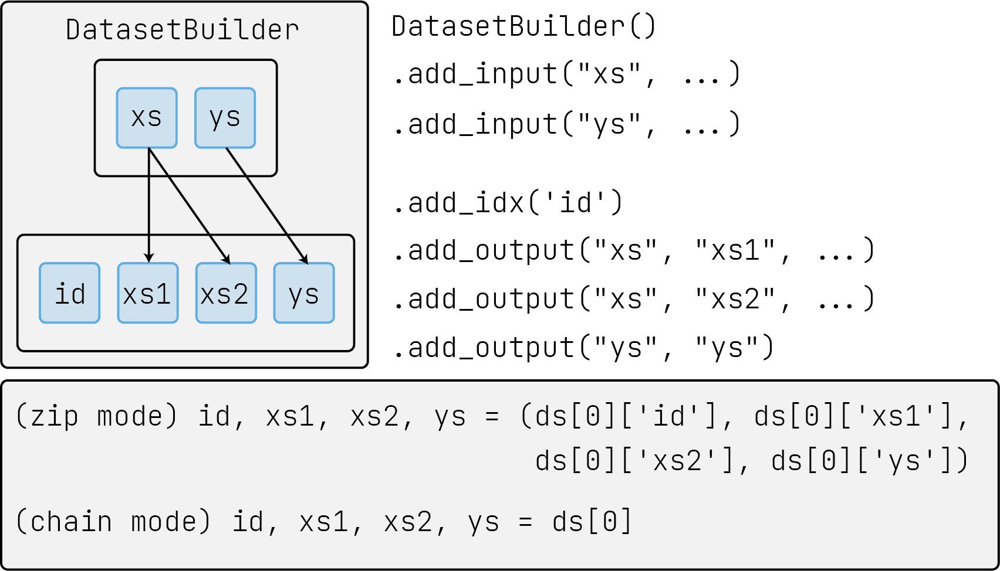

# lumo

[](https://badge.fury.io/py/lumo)

[](https://github.com/pytorch-lumo/lumo/blob/master/LICENSE)


`lumo`：轻量、可扩展、功能解耦合的 Pytorch 实验框架。

lumo 的设计理念：

- 模块解耦合：所有模块可以单独作为您现在使用的框架中的一个插件使用（而不像其他框架几乎耦合在一起）
- 恰到好处的抽象：和模型相关的细节完全由使用者掌控，lumo 只封装了外部通用逻辑（而不像其他一些框架会代理模型初始化或损失迭代）
- 覆盖整个生命周期：数据集构建、模型初始化、随机种子、训练/测试...，lumo 为所有步骤提供了功能包或流程简化
- 极强的可扩展性：从单文件到包含多个领域多个方法的项目，lumo 都可以提供舒适的使用体验。已在两个领域有复现项目的最佳实践示例（见[Related Work](#Related Work)）。

# 如何使用

## 安装

从 pypi 或 github 主页安装最新的稳定版本：

```bash
pip install -U lumo
pip install git+https://github.com/pytorch-lumo/lumo
```


## 快速开始

本节包含 lumo 最常用的几个子功能，帮助使用者快速利用这些功能减少已有项目中的冗余代码，这些功能包括：

- 一些常用功能的更优替代，如 [Params](#参数控制)（arguments 的平替），[Logger](#变量&日志记录)（logging 的平替）
- 一些训练过程中部份流程的优化，如 [Experiment](#路径管理&版本控制)（提供无重复的实验路径管理、基于 git 的版本控制），[DatasetBuilder](#数据集构建)（更快构建数据集），

### 参数控制

`argparse` 的更优替代。`Params` 底层依托于 [omegaconf](https://github.com/omry/omegaconf) 和 [fire](https://github.com/google/python-fire)
，只需要简单的配置，就可以从文件、命令行中读取参数。

直接基于 Params 类定义参数：

```python
# python main.py --epoch=30 --dataset=100
from lumo import Params

params = Params()
params.epoch = 20
# 集成优化器参数，自带补全提示
params.optim = params.OPTIM.create_optim('Adam', lr=0.0001, weight_decay=4e-5)
# 数据集只能从 cifar10/cifar100 中选择，且默认为 cifar10，其他的选择会报错
params.dataset = params.choice('cifar10', 'cifar100')

# 从命令行参数中更新
params.from_args()
print(params.epoch)  # -> 30
print(params.dataset)  # -> cifar100

# 保存到文件
params.to_json('./config.json')
params.to_yaml('./config.yaml')
# 从文件中更新
params.from_json('./config.json')
params.from_yaml('./config.yaml')
```

也可以通过继承、多重继承来嵌套，组合参数。即使在命令行中输入了不存在的参数，Params 也会正常读取。 

### 变量&日志记录

`logging` 的更优替代。通过 Meter、Record 和 Logger，可以实现变量的记录和格式化输出。其中：

- Meter 记录单次的值
- Record 以一定规则归约 Meter 实例（如 mean、sum 等）
- Logger 用于代替 logging，除常用的 info、warn 等方法外，还提供了 inline 方法，可以在屏幕能单行更新（实际中，屏幕打印时间远小于训练时间，因此单行更新带来的时间开销可以忽略不计）。

```python
import random
import time

from lumo import Record, Meter, Logger

log = Logger()

record = Record()
for idx in range(256):
    meter = Meter()
    meter.last.i = idx
    meter.sum.acc = idx
    meter.mean.loss = random.random()

    record.record(meter)
    log.inline(record)  # 单行更新
    time.sleep(0.5)
    if idx % 50 == 0:
        log.newline()
        record.clear()

log.info(record)
```

### 路径管理&版本控制

`Experiment` 主要提供路径管理，可以为每一次试验根据实验名、日期、次数等自动提供不一样的保存路径。此外，Experiment 还可以通过 hook
提供如代码版本管理、元数据记录等功能。在实验中，可以使用其子类 `SimpleExperiment` 实现大部分需求。

```python
from lumo import SimpleExperiment
from lumo import Params

pm = Params()
pm.module = 'example'
pm.from_args()

# 注册该次实验，实验名为 `pm.module`
exp = SimpleExperiment(pm.module)
# 实验开始，该方法会调用已注册的 ExpHooks，完成代码版本控制等功能。
exp.start()

# 小数据通过 `.test_file()` 获得路径
fn = exp.test_file('params.json')
pm.to_json(fn)

# 大文件通过 `.blob_file()` 获得路径（这是约定，而不是强制，大文件也可以保存到 `.test_file()` 中）
fn = exp.blob_file('checkpoint.pt')
with open(fn, 'w') as w:
    w.write('write big data in blob file')

print(exp.test_root)
print(exp.get_prop('git'))  # see git commit history
exp.end()
```

### 数据集构建



`DatasetBuilder` 是采用有向无环图思路设计的数据集构建类，该类提供了一个恰当的抽象逻辑，避免了在一个实验里定义多个重复 Datasets 类。

`DatasetBuilder `将数据集的构件划分为输入-输出两阶段，同时提供 `.chain()`（序列格式）和`.zip()`（字典格式） 两种输出方式。

```python
from lumo import DatasetBuilder
from torchvision.transforms import transforms
import torch

# Create a mnist-like dummy dataset
db = (
    DatasetBuilder()
        .add_input("xs", torch.rand(500, 28, 28))
        .add_input("ys", torch.randint(0, 10, (500,)))
        .add_idx('id')
        .add_output("xs", "xs1", transforms.RandomHorizontalFlip())
        .add_output("xs", "xs2", )
        .add_output("ys", "ys")
)
# Watch dataset structure
print(db)
# Builder(flow={'::idx::': ['id'], 'xs': ['xs1', 'xs2'], 'ys': ['ys']}, sized=True, size=500, iterable=True)

print(db[0])
# dict_keys(['id', 'xs1', 'xs2', 'ys'])
```

# 更多教程

# Related Work

- [image-classification](https://github.com/pytorch-lumo/image-classification): supervised/semi-supervised/self-supervised/noisy label learning on image-classfication
  field. (suporrted datasets: CIFAR10/CIFAR100/STL-10/SVHN/ImageNet/tinyimagenet)
- [emotion-recognition-in-conversation](https://github.com/pytorch-lumo/emotion-recognition-in-conversation):Multimodel emotional recognition on conversation. (suporrted datasets: IEMOCAP/MELD/MOSEI) 


# Acknowledge

 一个人维护一个库四年，背后的动力是我持续不断的使用，感谢 lumo 陪我见证我的学术生涯。lumo 确实不一定适合所有人的习惯，但一定最适合我自己。lumo 取自 lumos，这是哈利波特里魔法杖发光的咒语。torch 是火炬，ignite 是点燃，所以 lumo 也向往着发光发热，希望 lumo 给大家带来美好的使用体验。

# License 

Distributed under the GNU General Public License 3.0. See [LICENSE](./LICENSE) for more information.

# Contact

 - [sailist@outlook.com](mailto:sailist@outlook.com)

