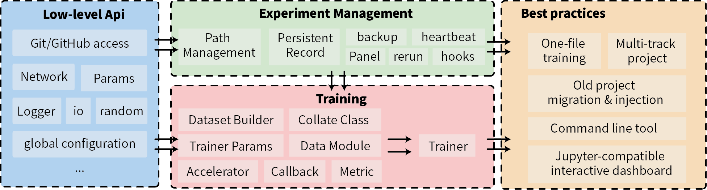

[中文](./README.ch.md)

# lumo

[](https://badge.fury.io/py/lumo)

[](https://github.com/Lightning-AI/lightning/blob/master/LICENSE)


`lumo` is a streamlined and efficient library that simplifies the management of all components required for experiments
and focuses on enhancing the experience of deep learning practitioners.

- **Experimental Management**: **Assign unique id and path** for each run, distinguish and store various file types;
  manage **code snapshots** through git; **record all information** generated during the experiment to ensure
  traceability and reproducibility.
- **Parameter Management:** Provides more convenient **parameter management** than argparser based on fire.
- **Runtime Configuration:** Provides configuration management under multi-level scopes.
- **Visualization:** Provides an Jupyter-compatible interactive dashboard for experiment management based
  on [Panel](https://panel.holoviz.org/index.html).
- Additional optimization for deep learning:
    - **Training:** Provides easily extendable training logic based on Trainer and provides comprehensive callback
      logic.
    - **Optimizer:** Integrated parameter and optimizer construction.
    - **Data:** Abstraction of dataset construction process, combination of multiple DataLoaders, etc.
    - **Distributed Training:** Also supports multiple training acceleration frameworks, unified abstraction, and easy
      switching at any time.
- More utilities...
- **Type Hint:** Support as much as possible for modern IDE's auto-completion.



# :book: Table of Contents

- :cloud: [Installation](#cloud-installation)
- :book: [Quick Start](#book-quick-start)
    - :small_orange_diamond: [Embedding into Existing Projects](#small_orange_diamond-embedding-into-existing-projects)
    - :small_orange_diamond: [Building from Scratch](#small_orange_diamond-building-from-scratch)
    - :small_orange_diamond: [Visual Interface](#small_orange_diamond-visual-interface)
    - :small_orange_diamond: [re-run](#small_orange_diamond-re-run)
    - :small_orange_diamond: [backup](#small_orange_diamond-backup)
- :scroll: [License](#scroll-license)
- [Full Document](https://pytorch-lumo.github.io/lumo/)

# :cloud: Installation

Install the published and tested version:

```bash
pip install -U lumo
```

Or install the latest version from the dev1 branch:

```bash
pip install git+https://github.com/pytorch-lumo/lumo@dev1
```

The experiment panel depends on Panel, which needs to be installed separately:

```
pip install panel
```

# :book: Quick Start

Here are two classic scenarios:

## :small_orange_diamond: Embedding into Existing Projects

For existing projects, you can quickly embed `lumo` by following these steps:

- Import `lumo` and initialize Logger and Experiment:

```python
import random
from lumo import SimpleExperiment, Params, Logger, Meter, Record

logger = Logger()
exp = SimpleExperiment(exp_name='my_exp_a')
exp.start()
logger.add_log_dir(exp.mk_ipath())
```

- Initialize parameters:

```python
params = Params()
params.dataset = params.choice('cifar10', 'cifar100')
params.alpha = params.arange(default=1, left=0, right=10)
params.from_args()  # python3 train.py --dataset=cifar100 --alpha=0.2
print(params.to_dict())  # {"dataset": "cifar100", "alpha": 0.2}
```

- Record parameters and store information during training:

```python
exp.dump_info('params', params.to_dict())
print(exp.test_name)

params.to_yaml(exp.mk_ipath('params.yaml'))

for i in range(10):
    max_acc = exp.dump_metric('Acc', random.random(), cmp='max')
    logger.info(f'Max acc {max_acc}')

    ckpt_fn = exp.mk_bpath('checkpoints', f'model_{i}.ckpt')
    ...  # save code given ckpt_fn

record = Record()
for batch in range(10):
    m = Meter()
    m.mean.Lall = random.random()
    m.last.lr = batch
    record.record(m)
    logger.info(record)

exp.end()
```

## :small_orange_diamond: Building from Scratch

If you want to start a new deep learning experiment from scratch, you can use `lumo` to accelerate your code
development.
Below are examples of `lumo` training at different scales:

one-fine training:

| Example                                     | CoLab | Lines of Code |
|---------------------------------------------|-------|---------------|
| [MNIST example](./examples/mnist.py)        |       | 118           |
| [MocoV2 trains CIFAR10](./examples/moco.py) |       | 284   |
| [Multi-GPU training ImageNet]()             |       ||

Experimental project:

| Project                                                                                                       | Description                            |
|-----------------------------------------------------------------------------------------------------------|-------------------------------|
| [image-classification](https://github.com/pytorch-lumo/image-classification)                              | Reproducible code for multiple papers with full supervision, semi-supervision, and self-supervision      |
| [emotion-recognition-in-coversation](https://github.com/pytorch-lumo/emotion-recognition-in-conversation) | Reproducible code for multiple papers on dialogue emotion classification and multimodal dialogue emotion classification |

## :small_orange_diamond: Visual Interface

In jupyter:

```python
from lumo import Watcher

w = Watcher()
df = w.load()
widget = w.panel(df)
widget.servable()
```


Manually filtered experiments for visualization:


You can directly use the command line:

```
lumo board [--port, --address, --open]
```

## :small_orange_diamond: re-run

Experiment that failed due to certain reasons can be **re-run by using the unique experiment ID (test_name)** , extra
parameters can be **reassigned and replaced**.

```
lumo rerun 230313.030.57t --device=0
```

## :small_orange_diamond: backup

Backing up experiment information to a Github issue (based on PyGitHub):

```python
from lumo import Experiment, Watcher
from lumo import glob

glob[
    'github_access_token'] = 'ghp_*'  # Default value for `access_token`. It is recommended to store the access_token in the global configuration `~/.lumorc.json`.

w = Watcher()
df = w.load()

# Selecting a single experiment for backup
exp = Experiment.from_cache(df.iloc[0].to_dict())
issue = exp.backup('github', repo='pytorch-lumo/image-classification-private',
                   access_token='ghp_*',
                   update=True,  # If already backed up, overwrite the previous issue
                   labels=None,  # Optional labels
                   )
print(issue.number)

# Batch backup and add labels based on each experiment's parameters
issues = df.apply(
    lambda x: Experiment.from_cache(x.to_dict()).backup(..., labels=[x['params'].get('dataset', '')]),
    axis=1
)
```


# Full properties

```
{'agent': nan,
 'backup': {'23-03-17-003438': {'backend': 'github',
                                'number': 9,
                                'repo': '...'},
            },
 'exception': nan,
 'execute': {'cwd': '~/Documents/Python/lumo',
             'exec_argv': ['~/Documents/Python/lumo/a.py'],
             'exec_bin': '~/.pyenv/versions/3.9.16/bin/python3.9',
             'exec_file': '~/Documents/Python/lumo/a.py',
             'repo': '~/Documents/Python/lumo'},
 'exp_name': 'my_exp_a',
 'git': {'commit': '1014b6b5',
         'dep_hash': 'c93b8c4e340882f55cf0c8e125fa0203',
         'repo': '~/Documents/Python/lumo'},
 'hooks': {'Diary': {'loaded': True, 'msg': ''},
           'FinalReport': {'loaded': True, 'msg': ''},
           'GitCommit': {'loaded': True, 'msg': ''},
           'LastCmd': {'loaded': True, 'msg': ''},
           'LockFile': {'loaded': True, 'msg': ''},
           'RecordAbort': {'loaded': True, 'msg': ''}},
 'lock': {'accelerate': '0.16.0',
          'decorator': '5.1.1',
          'fire': '0.5.0',
          'hydra': '1.3.2',
          'joblib': '1.2.0',
          'lumo': '0.15.0',
          'numpy': '1.24.2',
          'omegaconf': '2.3.0',
          'psutil': '5.9.4',
          'torch': '1.13.1'},
 'note': 'This is a Note',
 'params': {'alpha': 1, 'dataset': 'cifar10'},
 'paths': {'blob_root': '~/.lumo/blob',
           'cache_root': '~/.lumo/cache',
           'info_root': '~/.lumo/experiments'},
 'pinfo': {'hash': '0af4b77497c85bc5b65ccbdd9ff4ca0f',
           'obj': {'argv': ['~/.pyenv/versions/3.9.16/bin/python3.9',
                            '~/Documents/Python/lumo/a.py'],
                   'pid': 63975,
                   'pname': 'python3.9',
                   'pstart': 1678898740.099484},
           'pid': 63975},
 'progress': {'end': '23-03-16-004542',
              'end_code': 0,
              'last_edit_time': '23-03-16-004542',
              'ratio': 1,
              'start': '23-03-16-004542',
              'update_from': None},
 'tags': [],
 'test_name': '230316.000.8ct',
 'trainer': nan}
```

# :scroll: License

Distributed under the Apache License Version 2.0. See [LICENSE](./LICENSE) for more information.
