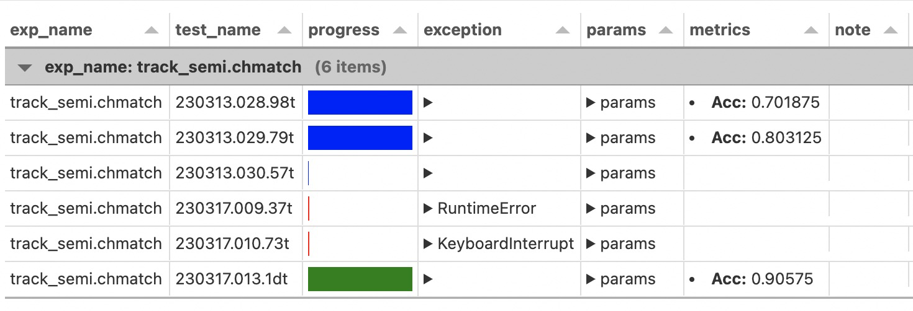

# Reproducibility

在 lumo 中，`Experiment` 为保证实验可复现提供了足够的保障。具体的，Experiment 从路径管理、版本控制、参数记录、备份四个角度来保证。并通过可视化面板、命令行接口等简化了操作门槛。

## 路径管理

为了保证路径不重复，`Experiment` 会为每次实验运行分配一个唯一实验 ID (`test_name`)。同时，`Experiment` 提供三种不同类型的数据存储路径，分别用于存储信息（info_dir）、二进制文件(blob_dir)、临时文件(cache_dir)，三者的路径关系如下：

```
- <cache_root>
    - <exp_name>
        - <cache_dir>

- <info_root>
    - <exp_name>
        - <info_dir>

- <blob_root>
    - <exp_name>
        - <blob_dir>

```

## 版本控制

`Experiment` 的生命周期包括 start/progress/end，在每个生命周期，都设置了一系列 `ExpHook` 类来执行部分操作。其中，负责 git 提交的是 `~lumo.exp.exphook.GitCommit`，会在 `on_start` 时检查文件的更改，如果存在，则向 `lumo_experiments` 分支提交一份当前的文件快照。当前代码所对应的 commit 等信息会全部记录到该 `Experiment` 实例的 `info_dir` 中。可以通过 `exp.properties['git']` 查看。

## 参数记录

参数记录包括超参数、程序执行参数等启动时参数，Metric 等运行时和运行后参数以及执行时间等元信息。除了超参数外，所提到的全部信息都会通过 `Experiment` 在 `.start()` 时自动记录。而实验的超参数，则可以通过`exp.dump_info('params',params_dict)` 自行记录。

> 使用 lumo.Trainer 训练时，使用到的超参数会自动记录到 `params` key 中。

对于 Metric，`Experiment` 实例可以通过 `.dump_metric` 和 `.dump_metrics()` 进行记录，如：

```python
max_acc = exp.dump_metric("acc",acc, "cls_acc", cls_acc)
```

# Retrieve

`Watch` 会将所有实验的信息进行整合，从而允许用户全盘检索某次实验。

```python
from lumo import Watcher, Experiment

w = Watcher()
df = w.load() # all experiments

exp = Experiment.from_cache(df.iloc[0].to_dict())
```

对某个已知 `test_name` 的实验，可以通过 `retrieve` 方法直接获取 `Experiment` 实例：

```python
w.retrieve('230306.012.d5t')
>>> Experiment(info_dir=".../.lumo/experiments/moco.mocoexp/230306.012.d5t")
```

## 可视化面板

一个固定样式的面板永远不能满足所有人的需要，所以，lumo 基于 pandas 和 panel 提供了动态面板，除了固定的几个部分外，其余所有样式均由使用者自行添加：

```python
from lumo import Watcher
w = Watcher()
df = w.load()

... filter operations ...

new_df = ...

w.panel(new_df)
```



## 重复实验

重复实验主要存在于两个场景：

- 为了验证结果稳定性而使用其他随机种子重新以相同参数运行实验
- 在实验中途因为显存、内存等原因实验出错需要以类似参数运行实验

尤其是在扫参时，如果仅有一两个实验出现了问题，直接基于日志观察，很难快速的知道失败的实验的运行参数。lumo 提供了 `rerun` 这一命令行参数，对于通过可视化面板或其他方式得到的失败的实验 ID (test_name)，可以直接通过如下的命令重跑，并重新指定参数：

```bash
lumo rerun 230315.017.bbt --device=0
lumo rerun 230315.012.29t --seed=1
```

`rerun`除了保证运行参数完全可控，还会在原实验和新实验之间建立一个双向链接，用于提示实验的重复次数等，可以分别在原实验和新实验的 `rerun` 参数中观察到：

```python
exp.properties['rerun']
>>>  {'from': '230310.002.f5t', 'repeat': 1}

exp2.properties['rerun']
>>>  {'rerun_at': {'230311.004.87t': True}}
```

## 备份

`Experiment` 额外提供了备份方法，可以向不同的途径记录实验。

### GitHub

```python
from lumo import glob
glob['github_access_token'] = '...' # or store in .lumorc.json
exp.backup('github',repo='pytorch-lumo/lumo')
```

```python
from lumo import glob
exp.backup('github',repo='pytorch-lumo/lumo', access_token='...')
```

### 本地/远程备份

- [ ] TODO

### 代码快照

- [ ] TODO

# 其他

## 生命周期

所有经过 `Experiment` 对实验信息的改动都会自动触发一次变更记录，会在 `exp.heartbeat_fn` 位置创建一个文件。该文件会被 Watcher 在 `.load()` 的时候检测到，并增量更新该实验的内容。`Experiment` 实例在创建时，如果是通过 `.from_cache()` 创建的，也会检测该文件是否存在，如果存在，则从原目录中重新加载，而忽略 cache 的内容。

```
- progress
    - <exp_name>
        - {test-1}.hb
        - {test-1}.pid
```

## ExpHook

目前支持的 ExpHook 有：

- `~lumo.exp.exphook.LastCmd` : 在项目根目录（或运行目录）记录运行命令的 history。
- `~lumo.exp.exphook.RecordAbort` : 在项目抛出异常时在 `exp.properties["exception"]` 记录异常内容。
- `~lumo.exp.exphook.GitCommit` : 在每次实验开始时保存实验快照，并记录 commit 信息到 `exp.properties['git']`
- `~lumo.exp.exphook.LockFile` : 在每次实验开始时保存相关库的版本信息，记录到 `exp.properties['lock']`
