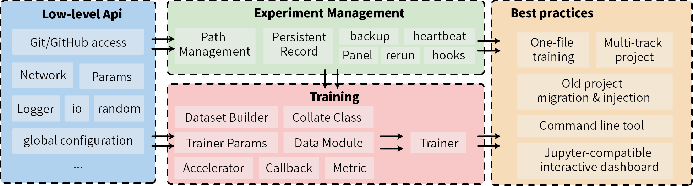

#! https://www.zhihu.com/question/269707221/answer/985429519

# 实验管理需要记录哪些内容

在深度学习中，实验相关的数据是一个 `[参数，代码，输出]` 构成的三维矩阵，其中参数包括实验环境（时间地点、是否多卡、版本等）和超参数，代码（主要）包括数据、模型、算法，输出则是训练过程中的日志和 Metric。在深度学习中，要保证每一次代码运行的结果都可复现、可回溯，就需要记录好当次实验的参数、代码、输出。

**参数**：在程序运行过程中，可以使用 json 等格式保存对参数的记录。其中，可记录的项包括：

- 通过 `sys` 可以获取代码执行时的命令行参数，如 `sys.executable`，`sys.argv`
- 在追加命令行参数解析后实验的超参数 `params`
- 时间、机器等基本信息
- `torch` 等关键库版本

**代码**：使用 `git` 对代码进行记录。在记录完快照后，还需要建立当前快照的 hex 和当前运行的实验的映射关系。

**输出**：在参数和代码保证的情况下，输出的必要性相对较小，但必要的输出记录可以有效加快实验分析总结的效率，防止无用功。因此，需要平衡好输出记录的空间和时间开销和内容的丰富度。在大多数情况下，做好以下内容就可以保证主要输出被记录：

- 用配置好路径的 Logger 代替 print 来保证当前程序的所有输出被记录
- 使用 exithook 来**尽量**保证抛出的异常能在程序退出前被捕获并记录
- 记录并输出每一次迭代后训练集和测试集的关键指标
- 记录最佳模型（best model）和最后一次模型（last model）

# 中途失败的实验是否要记录

答案：需要。

会有人将失败的代码用新实验覆盖，或者将参数完全重复的实验覆盖，但是覆盖的逻辑很危险。如果一个运行进度为 99% 的实验因为内存异常而退出，此时覆盖的逻辑有可能浪费掉这一次实验的结果，即使这次失败的实验记录的内容已经足够起到验证结果。

最好的办法定期手动清理，且不在程序中使用任何的覆盖逻辑。每一次实验都应该具有一个唯一的目录记录上一节提到的所有内容，即使是**完全重复**的实验，也应该做记号表示新实验是对某个旧实验的重复，在逻辑上表示覆盖，而不是在物理上表示。对工程开发熟悉的人可能会更理解这一行为：在做删除操作时，通过一个标记来标识内容被删除而不是真的在硬盘上进行删除。

# 用什么标识一次实验

从想法开始到中稿，中间可能会有几十到几百次实验，因此实验的唯一标识非常重要，它需要在保证唯一性的基础上尽可能的具有语义特征。

一个合适的方案应该同时结合自动与手动标识，其中自动标识用于在运行时确定唯一保存的路径名，可以牺牲一定的语义性，而手动标识则用于对关键实验在语义上进行解释，提高实验重要性，方便回溯。在此基础上，自动标识可以是 `<基于文件名的实验名>/<日期>.<当日次数>.<随机字符串>`，手动标识则可以保存在该路径下，用于之后的检索。

# 优先选择复制而不是复用

上文提到，深度学习的代码包括数据、模型、算法三部分，在调整想法时，为了**控制变量，设置对照**，往往只会调整其中一个要素。此时，一般存在两种选择：

- 添加一个超参数，并增加一个 `ifelse` 判断来复用旧实验代码，通过超参数来控制代码的逻辑是原想法还是新想法
- 复制相关文件，并对变动的部分做改动

第一种选择会减少冗余代码的存在，但在大多数情况，尤其是在遵循了上述实验记录逻辑的情况下，第二种选择其实是更高效率的，即使它带来了一些代码的冗余（复制后的文件和原文件会有很多重复内容）。理由如下：

- 第一种选择下，旧实验（也是旧想法）缺少新增参数，而新实验（无论是旧想法还是新想法）永远添加了新参数，这阻碍了对旧想法对应实验的区分。即使第一个改动仍然可以被区分，但如果一致遵守第一种选择，那么这种问题会越来越多，从而增加心智负担。
- 第二种选择则不存在这种问题，没有新增参数，只有想法的改动。而且这种改动可以相对容易的通过文件名的变化、文件内的注释辅助理解。当然，在存在另一个通用改动时，第二种选择会导致需要修改的文件更多，但这种情况下往往只需要继续复制文件并修改即可。这种方式代码复杂度是平行增长，分摊在每个文件上的，而不是堆在一个文件中。

当然，这并不是说不需要复用。而是说需要更谨慎的选择复用。在深度学习实验中，以下内容往往是可以被复用的：

- 模型的 backbone：大部分方法不需要更改模型内部结构，而是在 feature_map 之后的结构上进行修改。
- 优化器：大部分方法不会对优化器进行更改。
- 指标：在一个具体的 track 内，需要比较的指标往往是固定的
- 测试逻辑：在一个具体的 track 内，用什么数据测试，怎么测试往往都是确定的

# 使用 lumo 管理实验

[lumo](https://github.com/lumo-tech/lumo) 是我打磨了 4 年的实验管理框架，提供了上述所分析的所有功能和细节，并针对深度学习的各个细节进行了优化。此外，在[图像分类](https://github.com/sailist/image-classification)和[多模态情感分类](https://github.com/sailist/emotion-recognition-in-conversation/)两个 track 下的实践已证明了将 lumo 用于实验管理的可行性。

[lumo](https://github.com/lumo-tech/lumo) 在这近两个月经历了一次重构，补全了测试和文档，由此分享给所有人。

