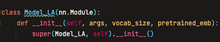
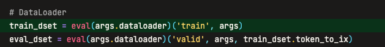
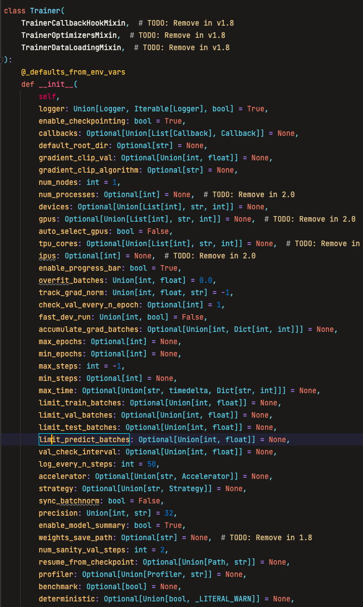
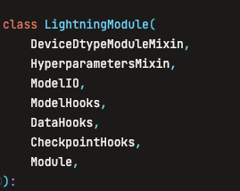

# 完美主义者的深度学习代码结构最佳实践

# 太长不看简略版

你可以用 lumo 解决你在写代码过程中遇到的所有问题。它类型友好、模块解耦，我本人自己使用并不断 debug 了两年，并对一些关键部份都编写了测试，已经足够稳定。你可以戳下方链接进一步了解和安装它：

同时，它提供了一套代码组织方案，是我在使用期间探索出的一套最佳实践，能够在一个大方向（比如图像分类领域）内以低代码复杂度近乎任意的扩展新方法。我提供了我两个研究方向的模板，分别是图像分类和多模态情感识别。你可以戳下方链接进一步了解和使用它们。

# 前言

>

# Why？

为什么我要开发 lumo？

我刚开始入坑深度学习的时候，还没有太成熟的框架，而且也没有找框架的意识，所以一直靠自己维护了一套逻辑，之前起名叫 TorchHelper，勉强凑合着用。再后来有一段时间接触了一些训练框架后，就开始发现完全用不习惯。这个时候我已经被我的框架“驯化”了。这甚至不是迁移成本的问题，而是真的其他框架没有我的效率高的问题。

后来 TorchHelper 优化了一遍又一遍，又重构了两次，后来我想给它认真起个名字，最后选了 lumo。像 torch 是火炬，ignite 是点燃，lightning 是闪电。lumo 有光的意思，闪亮的微光的那种含义，哈利波特里魔法杖发光的咒语就是 lumos。

再后来 lumo 越用越顺手，解耦的模块设计能很快速的在其他人提供的代码里插入一些日志、指标输出的代码，基于 lumo 的代码也让我能很快的把其他人的代码整合到我的代码里。

有人说，完美主义和二八原则是可以共存的。共存的方式是，当你用 100% 的精力做出来某事，那么你要再多花一些时间让其他人知道这件事，这样就可以用额外的附加值弥补精益求精带来的机会成本损失。

# 错误的代码结构

众所周知，Python 是一门动态语言，torch 当年选择了 Python 来作为它的生态的原因之一就是 Python 简单易用。但 Python 成在了动态语言，也败在了动态语言。像 javascript 一样，Python 3.5 之前不存在类型提示，而即使是在 3.5 之后，它的类型提示也非常的“弱”（相比于 Typescript），变量的类型很容易就会“断”掉。这导致，Python 给的自由很容易就会“过了火”。

下面列举我经常看见的几种典型的令人头秃的代码结构。

## 继承地狱

在 js 里经常有回调地狱（callback hell）的说法。而继承地狱是我造的新词，专指对模型或 Trainer 采用多继承和多级继承的方式通过增加代码复杂度的方式减少代码量的操作。

继承地狱的主要问题是，当变量或者函数在某个类的父类爷爷类有各自的定义时，经常没有办法定位到运行它的真实位置。你如果不仔细的分析代码，或者在运行时 debug，那么就可能看错真正用到的变量或者代码，导致误解。

## 配置地狱

配置地狱也是新造的词，指把所有的可能一股脑的都塞到没有类型提示的配置里，并把所有的数据集、模型、Trainer 都通过配置获取，导致你基本只能在运行时 debug 来得知实际运行的代码位置和变量值，而且没有办法通过 IDE 灵活跳转。

比如把 `ArgumentParser` 解析出来的 args 变量之间往模型里传：



## 乱用动态特性




# 竞品分析

在开发过程中，我参考学习了大量 pytorch-lightning 的...英语注释。我仅仅使用了两天 pytorch-lightning 就放弃了，并且在随后的日子里反复吐槽 pytorch-lightning 存在的问题。在我看来，lightning 的技术路线（api 设计）就是错误的。

## 做的多与少

我最惊讶的是 lightning 默认是自动帮用户实现梯度回传的。当你要设计一个模块，有两个损失，两个优化器单独训练的时候怎么办？

```python
def training_step(self, batch, batch_idx):
    # training_step defines the train loop. It is independent of forward
    x, y = batch
    x = x.view(x.size(0), -1)
    z = self.encoder(x)
    x_hat = self.decoder(z)
    loss = F.mse_loss(x_hat, x)
    self.log("train_loss", loss)
    return loss

def configure_optimizers(self):
    optimizer = torch.optim.Adam(self.parameters(), lr=1e-3)
    return optimizer
```

`LightningModule` 继承自 Module，默认应该在 forward 函数里写，改到了 `training_step`，是否不合理？

创建 Optimizer 的时候，需要调 lr 参数，应该怎么改才能保证类型提示？

在 Model 里理应只放 Parameter 或 Tensor，`LightningModule` 放了这么多东西。

...

lightning 野心很大，什么都想做，但它想做的事又都没考虑全，封装的又很死，最终导致了初看很美好，定制自己搞。一旦有更深一点的需求，就需要自己翻 lightning 实现默认操作的函数进行修改。

## 配置繁杂

在 Trainer 中 pytorch-lightning 细心的将所有常用配置都暴露在了 Trainer 类的外部：



这一设计好处是熟悉 api 的人可以灵活的修改代码来控制训练细节。这一设计同样也存在问题。

首先，你不能保证你只需要这些配置。有更多需要 Trainer 来控制的情况下怎么办？

此外，它还违背了一个理念：如无必要，勿增实体。当参数不需要时，它就不应该出现。

最后，lightning 一开始就主打什么都帮你做，这不仅仅包括日志管理实验管理，也包括具体的训练内容，比如梯度回传，而它又隐式的在参数中定义了这么多默认值。它的职责太不明确了。那么，当你的实验出问题时，你如何确认是它做的部分出来问题还是你做的部分出来问题？你迟早会将所有它帮你写的地方重新改成自己掌控。

## 技术路线问题

pytorch-lightning 的启动逻辑从很早之前就固定了。它把训练逻辑混合在了 `torch.nn.Module` 的设计里。要使用 lightning，你需要在 `pl.LightningModule` 内定义你的模型、优化器、训练逻辑。你还可以在这个类里找到 logger。

```python
class LitAutoEncoder(pl.LightningModule):
    def __init__(self):
        super().__init__()
        self.encoder = nn.Sequential(nn.Linear(28 * 28, 128), nn.ReLU(), nn.Linear(128, 3))
        self.decoder = nn.Sequential(nn.Linear(3, 128), nn.ReLU(), nn.Linear(128, 28 * 28))

    def forward(self, x):
        # in lightning, forward defines the prediction/inference actions
        embedding = self.encoder(x)
        return embedding

    def training_step(self, batch, batch_idx):
        # training_step defines the train loop. It is independent of forward
        x, y = batch
        x = x.view(x.size(0), -1)
        z = self.encoder(x)
        x_hat = self.decoder(z)
        loss = F.mse_loss(x_hat, x)
        self.log("train_loss", loss)
        return loss

    def configure_optimizers(self):
        optimizer = torch.optim.Adam(self.parameters(), lr=1e-3)
        return optimizer
```

`LightningModule` 相比于 `nn.Module` 额外继承了 6 个类。而在 `LightningModule` 本身就包含了半个 Trainer 的同时，要运行它的的训练逻辑，你还需要再额外套一层 `trainer.fit()`。

```python
dataset = MNIST(os.getcwd(), download=True, transform=transforms.ToTensor())
train, val = random_split(dataset, [55000, 5000])

autoencoder = LitAutoEncoder()
trainer = pl.Trainer()
trainer.fit(autoencoder, DataLoader(train), DataLoader(val))
```

这种将所有东西塞到 Model 里的写法，很容易出现继承地狱。



## 结论

pytorch-lightning 或许是在炫技。开发人员想必有很多大型工程的开发经验，从而忽略了研究人员这一类 Deep learner 群体的需求，忘记了小而美的，对研究者友好的接口和设计应该怎么写。

# 对最佳实践的探索

我认为，最佳实践下的深度学习代码结构，需要至少同时满足以下条件：

- 可扩展：在添加数据集、模型、训练逻辑时，不增加代码的复杂度或者只以线性增加代码的复杂度。
- 可复用：一套结构，对所有方向都适用，切新方向时将模板一复制，做一些方向专属的修改就可以直接上手。
- 支持友好的版本控制：所有的实验都有迹可循，能够在需要时通过各种条件筛选找到并回滚。
- 类型友好且没有地狱：减少使用过程中查找一个变量的位置时不知道什么类型不知道来自哪个类的情况。

## 可扩展
